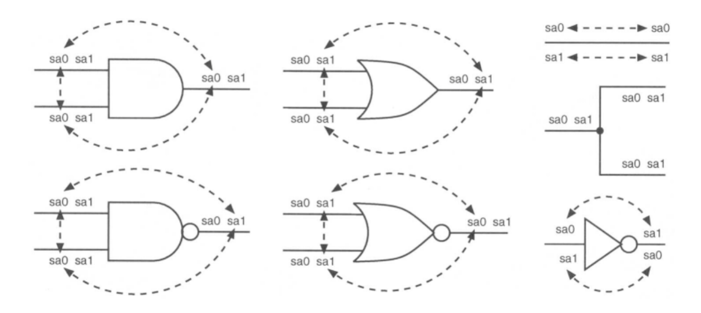

# Equivalent-Fault-Collapsing-in-Digital-Testing

## Description
This project focuses on implementing and analyzing equivalent fault collapsing techniques in digital testing and testability. Fault collapsing is a method used to reduce the number of faults that need to be considered during the testing of digital circuits, thereby optimizing the testing process.

## Installation
To set up the project locally, follow these steps:

1. Clone the repository:
    ```sh
    git clone https://github.com/sushanth3104/Equivalent-Fault-Collapsing-in-Digital-Testing.git
    ```
2. Navigate to the project directory:
    ```sh
    cd Equivalent-Fault-Collapsing-in-Digital-Testing
    ```


## Fault Equivalence

Fault equivalence is a key concept in Boolean circuit testing. **Two faults** in a Boolean circuit are called *equivalent* **if and only if (iff)** they transform the circuit such that the two faulty circuits produce **identical output functions**.

Equivalent faults are also called **indistinguishable** because they cannot be differentiated by any test. As a result, they have exactly the same set of tests, reducing the need for testing each fault separately and improving the efficiency of the testing process.


Each gate has associated equivalences between its inputs and outputs. The detailed relationships are illustrated in the image below:



### Fault Collapsing Algorithm

The fault collapsing algorithm uses follows the follows steps :

1. **Start from Primary Inputs:**
   - Fault collapsing is performed in a level-by-level manner, starting from the primary inputs and progressing towards the output.
   
2. **Process Each Gate Sequentially:**
   - A gate is not processed until all gates feeding its inputs have been processed.

3. **Examine Input Faults:**
   - For each gate, inspect the input faults.
   
4. **Retain Equivalent Faults:**
   - Among equivalent input faults, retain only one representative fault.

5. **Delete Redundant Faults:**
   - Any input faults equivalent to an output fault are removed.
 

## Image References
- Equivalent fault collapsing for Boolean gates, wires, and fanouts.
  - **Credit:M. Bushnell, Vishwani Agrawal** 

## Definitions and Concepts
- **Fault Equivalence:** Definition taken from **Essentials of Electronic Testing for Digital, Memory and Mixed-Signal VLSI Circuits (Frontiers in Electronic Testing)**
  - **Credit:M. Bushnell, Vishwani Agrawal** 

